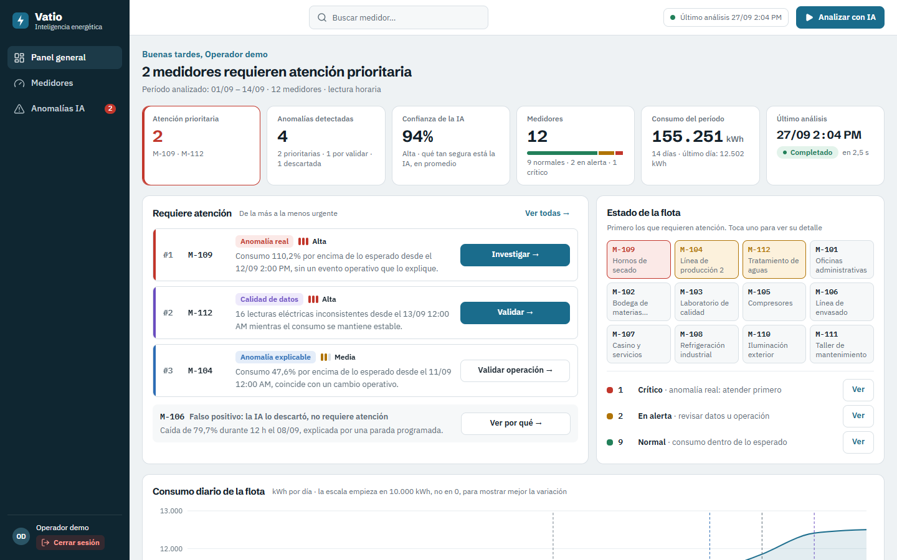
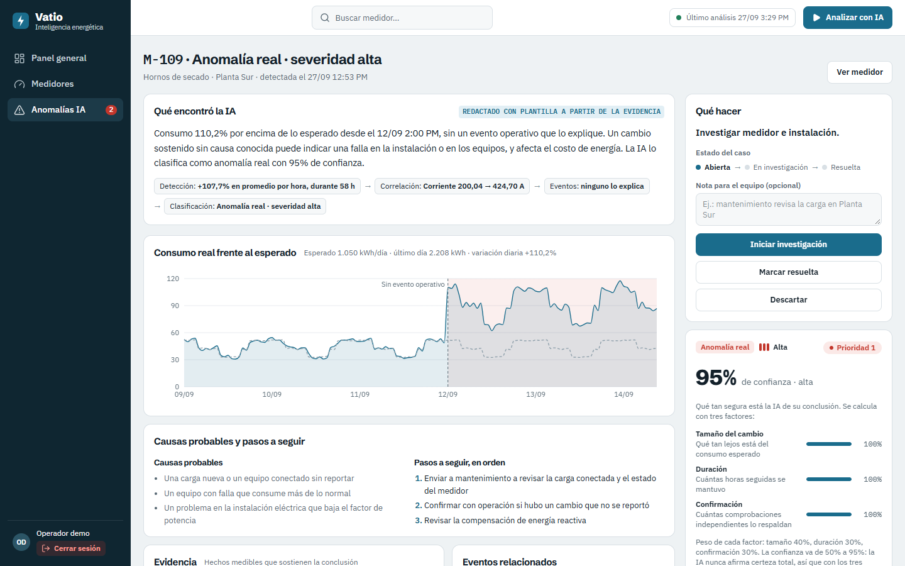
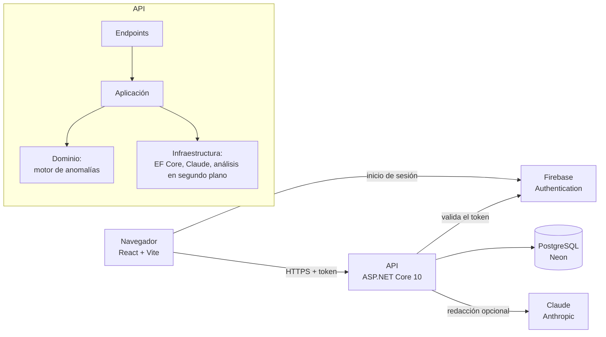

# Vatio · Plataforma de gestión energética con IA

[](https://github.com/JuanZF18/ai-energy-platform/actions/workflows/ci.yml)

Vatio revisa las lecturas de los medidores eléctricos de una planta, detecta lo que se sale de lo normal, explica por qué y dice qué medidor atender primero y qué hacer.

Es la solución a la prueba técnica **AI Energy Management Platform** de Bia Energy: un producto completo con backend, frontend, análisis de datos e inteligencia artificial.



## Contenido

1. [Pruébalo en un minuto](#1-pruébalo-en-un-minuto)
2. [Qué problema resuelve](#2-qué-problema-resuelve)
3. [Qué aporta la IA](#3-qué-aporta-la-ia)
4. [Resultados con los datos del reto](#4-resultados-con-los-datos-del-reto)
5. [Cómo detecta, explica y prioriza](#5-cómo-detecta-explica-y-prioriza)
6. [Arquitectura](#6-arquitectura)
7. [Tecnologías y decisiones](#7-tecnologías-y-decisiones)
8. [Correrlo en local](#8-correrlo-en-local)
9. [Configuración](#9-configuración)
10. [API](#10-api)
11. [Tests](#11-tests)
12. [Despliegue](#12-despliegue)
13. [Estructura del repositorio](#13-estructura-del-repositorio)
14. [Supuestos](#14-supuestos)
15. [Limitaciones conocidas y siguientes pasos](#15-limitaciones-conocidas-y-siguientes-pasos)

---

## 1. Pruébalo en un minuto

| | |
|---|---|
| **Video de la demo** | [Ver en Google Drive](https://drive.google.com/file/d/1sphM0TfVksFZHqfiCynhS4kvq2I40_GY/view?usp=sharing) |
| **Aplicación** | https://vatio-energy.web.app |
| **Cuenta demo** | `demo@vatio.app` · `demo1234` |
| **Documentación de la API** | https://vatio-api.fly.dev/docs |

Recorrido sugerido (el mismo de la sección 21 del reto):

1. **Iniciar sesión** con la cuenta demo.
2. En el **Panel general**, pulsar **Analizar con IA**. Se abre un panel con las 7 etapas del análisis, que termina con *"4 anomalías detectadas · 2 requieren atención prioritaria"*. En producción tarda unos 25 segundos, porque Claude redacta las explicaciones.
3. Pulsar **Ver M-109 (prioridad 1)**.
4. Leer **qué encontró la IA**, la **evidencia** y la **confianza**.
5. En **Qué hacer**, registrar la acción: *Iniciar investigación*, con una nota para el equipo.

> La API se suspende cuando no se usa y despierta con la primera petición, en 1 a 2 segundos.

## 2. Qué problema resuelve

Una planta tiene 12 medidores que registran cada hora el consumo, el voltaje, la corriente y el factor de potencia durante 14 días (4.032 lecturas). Revisarlas a mano es lento, y el reto pide algo más que una tabla: pide **convertir los datos en una decisión**.

La plataforma responde las seis preguntas de la sección 2 del reto:

| Pregunta | Dónde se responde |
|---|---|
| ¿Qué está pasando con los medidores? | Panel general y Medidores |
| ¿Qué lecturas se salen de lo esperado? | Detalle del medidor: gráfica real contra esperado, con el tramo anómalo marcado |
| ¿La anomalía es real, explicable o de calidad de datos? | Anomalías IA, columna Tipo |
| ¿Cuál investigar primero? | Lista ordenada por prioridad y la tarjeta *Atención prioritaria* |
| ¿Por qué la IA llegó a esa conclusión? | Investigación: evidencia, variables que cambiaron, eventos y confianza |
| ¿Qué acción recomienda? | Investigación: *Qué hacer*, con el estado del caso |

## 3. Qué aporta la IA

El valor está en el ciclo completo **DATOS → ANÁLISIS → ANOMALÍA → EXPLICACIÓN → PRIORIZACIÓN → ACCIÓN**. Con M-109 como ejemplo:

| Paso | Qué pasa con M-109 (hornos de secado) |
|---|---|
| **Datos** | 336 lecturas horarias de consumo, voltaje, corriente y factor de potencia. |
| **Análisis** | Se calcula su consumo normal para cada hora del día y se compara cada lectura contra ese valor. |
| **Anomalía** | Desde el 12/09 2:00 PM consume en promedio **+107,7 % por hora** durante 58 horas seguidas. |
| **Explicación** | La corriente sube igual que el consumo (200 A → 425 A), así que no es un error del contador; el factor de potencia cae de 0,94 a 0,74; y **ningún evento operativo lo explica**. |
| **Priorización** | Anomalía real, severidad alta, 95 % de confianza: **prioridad 1**. |
| **Acción** | *Investigar medidor e instalación*, con causas probables y pasos en orden. |

El análisis no se limita a decir sí o no: clasifica, explica con cifras y recomienda. Además, **descarta falsos positivos**: la caída de M-106 coincide con una parada programada y no se escala. Las decisiones las toma un motor estadístico verificable y la IA (Claude) las explica en lenguaje claro; la sección 5 detalla quién hace qué.



## 4. Resultados con los datos del reto

| Medidor | Qué pasó | Clasificación | Severidad | Confianza | Acción |
|---|---|---|---|---|---|
| **M-109** | +107,7 % por hora durante 58 h, sin evento que lo explique | Anomalía real | Alta | 95 % | Investigar |
| **M-112** | 16 lecturas eléctricas inconsistentes con consumo estable | Calidad de datos | Alta | 95 % | Validar |
| **M-104** | +47,6 % desde el 11/09, coincide con una nueva línea de producción | Anomalía explicable | Media | 93 % | Validar operación |
| **M-106** | −79,7 % durante 12 h, coincide con una parada programada de 12 h | Falso positivo | Baja | 88 % | No escalar |
| Los otros 8 | Consumo dentro de lo esperado | — | — | — | — |

El orden de prioridad es M-109 → M-112 → M-104 → M-106, que coincide con los criterios de la sección 18 del reto. El archivo `expected_results.csv` **no está en el repositorio y no se usa en ningún lugar**, como pide la sección 19.

La salida de la IA sigue el formato de la sección 10 del reto y se puede ver en la investigación (*Detalle técnico: resultado de la IA en formato JSON*):

```json
{
  "meter_id": "M-109",
  "anomaly": true,
  "type": "REAL_ANOMALY",
  "severity": "HIGH",
  "confidence": 0.95,
  "reason": "Consumo 110,2% por encima de lo esperado desde el 12/09 2:00 PM, sin un evento operativo que lo explique.",
  "recommended_action": "Investigar medidor e instalación."
}
```

La interfaz está toda en español. Los códigos del reto se conservan en el JSON y en la API:

| Código | En la interfaz |
|---|---|
| `REAL_ANOMALY` · `EXPLAINABLE_ANOMALY` · `DATA_QUALITY` · `FALSE_POSITIVE` | Anomalía real · Anomalía explicable · Calidad de datos · Falso positivo |
| `HIGH` · `MEDIUM` · `LOW` | Alta · Media · Baja |
| `OK` · `ALERT` · `CRITICAL` | Normal · En alerta · Crítico |
| `baseline` | Consumo esperado |

## 5. Cómo detecta, explica y prioriza

El enfoque es **híbrido**: un motor estadístico toma todas las decisiones y un modelo de lenguaje (Claude) solo las redacta. Así, cada conclusión se puede verificar con cifras y la plataforma sigue funcionando aunque el modelo falle.

### 5.1 Las 7 etapas del análisis

Son las mismas de la sección 13 del reto. El botón **Analizar con IA** las ejecuta en segundo plano y la interfaz muestra el avance.

| Etapa | Qué hace |
|---|---|
| 1. Lecturas | Carga las 4.032 lecturas de los 12 medidores. |
| 2. Consumo esperado | Calcula el consumo normal de cada medidor para cada hora del día: la **mediana** de esa hora en los 14 días. La mediana no se deja arrastrar por los días anómalos. |
| 3. Detección | Busca **cambios de consumo**, **voltaje fuera de la norma** y **lecturas eléctricas imposibles**, con las reglas de la sección 5.2. |
| 4. Correlación | Compara voltaje, corriente y factor de potencia antes y durante cada cambio. |
| 5. Eventos | Cruza cada caso con los eventos operativos registrados, con una tolerancia de 2 horas. |
| 6. Explicación | Clasifica cada caso y redacta la explicación con su evidencia. |
| 7. Recomendación | Asigna la acción, calcula la prioridad y actualiza el estado de cada medidor. |

El cálculo tarda milisegundos. Cada etapa espera un mínimo de 0,35 s (`Analysis:Pacing`) para que la persona alcance a ver el avance que pide el reto. Con Claude activo, la etapa de explicación tarda unos 20 segundos (una llamada de 5 a 9 s por caso); sin Claude, el análisis completo tarda unos 2,5 segundos.

### 5.2 Cuándo se abre un caso: gravedad × duración

El principio es el mismo que usan las normas eléctricas: **lo grave alerta de inmediato y lo moderado espera a confirmarse**, para no confundir el ruido normal de los datos con un problema.

| Señal | Moderado: espera a confirmarse | Grave: alerta de inmediato |
|---|---|---|
| **Consumo** | Entre 25 % y 50 % fuera de lo esperado: se reporta si dura **3 horas seguidas** | 50 % o más fuera de lo esperado: se reporta **desde la primera hora** |
| **Voltaje real** | — | Fuera del rango de la norma **NTC 1340** para baja tensión (+5 % / −10 %, es decir, 198–231 V): se reporta **desde la primera lectura** |
| **Lecturas imposibles** (error del medidor) | Se reporta con **3 o más lecturas** | — |

**Por qué estos números:**

- El ruido normal de estos medidores es de **3,4–5,7 % por hora**, y en los medidores sanos la peor hora se desvía 13–17 %. El 25 % queda por encima de todo el ruido observado, y el 50 % equivale a unas 10 veces el ruido: no puede pasar por casualidad ni en una sola hora.
- 3 horas es lo bastante largo para ignorar un arranque o un pico pasajero, y lo bastante corto para avisar en el mismo turno.
- Los resultados no dependen de haber ajustado los números: con duraciones de 1 a 6 horas y umbrales de 15 % a 40 %, se detectan exactamente los mismos casos.
- **Voltaje:** cada lectura es el promedio de una hora. Según la IEEE 1159, un voltaje fuera de rango por más de un minuto ya es una sobretensión o subtensión **sostenida**, así que una sola lectura horaria fuera de la norma basta para alertar.

**Voltaje real frente a error del medidor.** Una lectura con el voltaje fuera de la norma puede ser un problema de la red o un medidor que registra mal. Se distinguen comprobando la física: en una lectura real, el consumo cuadra con voltaje × corriente × factor de potencia. En las 16 lecturas malas de M-112 **no cuadra** (la energía llega a ser 4,2 veces la esperada) y el factor de potencia solo toma 3 valores repetidos, así que M-112 es un error del medidor (calidad de datos) y no un problema de voltaje.

### 5.3 Cómo se clasifica cada caso

| Situación | Clasificación | Severidad |
|---|---|---|
| El cambio coincide con una **parada programada** | Falso positivo | Baja |
| El cambio coincide con un **cambio operativo** y la parte eléctrica se ve sana | Anomalía explicable | Media |
| Ningún evento lo explica | Anomalía real | Alta si el desvío es de 50 % o más, o si el factor de potencia cae 0,08 o más; si no, media |
| Voltaje fuera de la norma, con lecturas coherentes | Anomalía real | Alta. Acción: revisar la alimentación con el operador de red |
| 3 o más lecturas imposibles | Calidad de datos | Alta si el problema sigue activo; si no, media |

Una lectura es **imposible** si su factor de potencia o la relación entre el consumo y voltaje × corriente × factor de potencia es muy atípica para ese medidor. Se usa un puntaje Z robusto mayor que 5, calculado con mediana y MAD para que los propios valores extremos no distorsionen la escala.

### 5.4 Confianza

La confianza dice qué tan seguro está el análisis de su conclusión. La calcula el motor, no el modelo de lenguaje, y combina tres factores:

- **Tamaño del cambio** (40 %): qué tan lejos está del consumo esperado.
- **Duración** (30 %): cuántas horas seguidas se mantuvo.
- **Confirmación** (30 %): cuántas comprobaciones independientes respaldan la clasificación. Por ejemplo, en M-109: la corriente acompaña el cambio, el factor de potencia se degrada, ningún evento lo explica y el cambio sigue activo.

```
confianza = 50 % + 45 % × (0,4 × tamaño + 0,3 × duración + 0,3 × confirmación)
```

El resultado va de 50 % a 95 %. **El análisis nunca afirma certeza total**, por eso con los tres factores al máximo marca 95 %.

### 5.5 Prioridad

```
prioridad = peso de la severidad × peso del tipo × confianza
```

| Severidad | Peso | | Tipo | Peso |
|---|---|---|---|---|
| Alta | 1,0 | | Anomalía real | 1,0 |
| Media | 0,6 | | Calidad de datos | 0,8 |
| Baja | 0,3 | | Anomalía explicable | 0,5 |
| | | | Falso positivo | 0,1 |

Una anomalía real de severidad alta siempre queda por encima de una explicable de severidad media, y el falso positivo queda al final, visible pero sin escalar.

### 5.6 Quién redacta la explicación

- **Con una llave de Anthropic**, Claude (`claude-sonnet-5`) redacta la explicación a partir de la evidencia. Tiene prohibido cambiar la clasificación, la severidad o la confianza, y **cada cifra que escribe se valida contra la evidencia**: si aparece un número que no está en los datos, la explicación se descarta y se usa la plantilla.
- **Sin llave, o si Claude falla o tarda más de 30 s**, se usa una **plantilla** que arma la explicación con las mismas cifras. La pantalla indica quién la redactó.
- Cada caso tiene una **huella** (medidor, tipo y momento en que empezó). Si un análisis nuevo encuentra el mismo caso con la misma evidencia, se reutiliza el texto ya escrito y no se vuelve a llamar a Claude; si la evidencia cambia, se redacta de nuevo. Así se controla el costo.

## 6. Arquitectura



El backend está dividido en cuatro capas:

| Capa | Qué contiene | Depende de |
|---|---|---|
| **Domain** | El motor de anomalías, las reglas de clasificación, la confianza y la prioridad. Es C# puro, sin base de datos ni HTTP. | Nada |
| **Application** | Casos de uso: listar medidores, consultar anomalías, cambiar su estado, pedir un análisis. | Domain |
| **Infrastructure** | EF Core con PostgreSQL, carga de los CSV, el trabajador que ejecuta el análisis y la integración con Claude. | Application, Domain |
| **Api** | Endpoints (minimal APIs), autenticación, OpenAPI y manejo de errores. | Todas |

El motor vive en `Domain` sin dependencias. Por eso se prueba sin base de datos y, si hiciera falta llevarlo a Go (el lenguaje sugerido por el reto), bastaría con traducirlo sin rediseñar nada.

**El análisis corre en segundo plano.** `POST /api/ai/analyze` responde `202 Accepted` de inmediato con el id de la corrida. Un trabajador la ejecuta y el front consulta el avance: cada 250 ms durante los primeros segundos, para que las etapas rápidas se vean fluidas, y luego cada segundo mientras Claude redacta. Si se pide un análisis mientras hay otro en curso, se devuelve el que ya está corriendo.

**Persistencia.** Todo queda en PostgreSQL: medidores, lecturas, eventos, anomalías, el historial de cambios de estado (con la nota y el correo de quien lo hizo) y las corridas de análisis. Al arrancar, la API aplica las migraciones y carga los CSV si la base de datos está vacía.

**Frontend.** React con TanStack Query. Los datos se consideran frescos durante 30 s y las pantallas que usan la misma consulta comparten una sola petición: el resumen del panel lo usan 5 componentes y se pide una vez. Los filtros, la búsqueda y el orden de Medidores se resuelven en el backend. Los de Anomalías se resuelven en el navegador a propósito: son 4 registros y los contadores de cada filtro necesitan la lista completa.

## 7. Tecnologías y decisiones

| Parte | Tecnología | Por qué |
|---|---|---|
| Backend | ASP.NET Core 10, C# | El reto sugiere Go, pero el correo de Bia aclaró que era preferencial. .NET permite entregar código idiomático y defendible en el tiempo disponible. |
| Frontend | React + Vite + TypeScript, TanStack Query, Tailwind CSS, Recharts | Ecosistema moderno; Vite compila rápido. Detrás de un login, el renderizado en servidor de Next.js no aporta. Los componentes se construyeron con Tailwind, sin librería de componentes. |
| Datos | PostgreSQL + EF Core | Relacional, con migraciones versionadas. En producción, Neon (PostgreSQL administrado). |
| IA | Motor estadístico + Claude | Las decisiones son verificables y repetibles; el lenguaje natural lo aporta el modelo, con plantillas de respaldo. |
| Despliegue | Fly.io (API) + Firebase Hosting (front) | Costo bajo (Firebase Hosting es gratuito y Fly.io cobra por uso), HTTPS incluido y despliegue con un comando. |
| Análisis | En segundo plano, con avance consultable | El análisis no bloquea la petición y la interfaz puede mostrar cada etapa. |
| Autenticación | Firebase Authentication, con un modo Demo de respaldo | Inicio de sesión real sin construir un sistema de usuarios; el modo Demo permite correrlo sin depender de Firebase. |

## 8. Correrlo en local

### Opción A: con Docker (recomendada)

Solo necesita [Docker Desktop](https://www.docker.com/products/docker-desktop/). No hace falta instalar .NET, Node ni PostgreSQL.

```bash
git clone https://github.com/JuanZF18/ai-energy-platform.git
cd ai-energy-platform
docker compose up --build
```

| Qué | Dirección |
|---|---|
| Aplicación | http://localhost:8080 (cuenta `demo@vatio.app` · `demo1234`) |
| Documentación de la API | http://localhost:5080/docs |

`docker compose` levanta tres contenedores:

- **db**: PostgreSQL 17, expuesto en el puerto 5433.
- **api**: la API, en modo Demo; aplica las migraciones y carga los CSV al arrancar.
- **web**: el front servido por nginx, que además reenvía `/api` a la API.

La primera vez tarda unos minutos, mientras descarga las imágenes y compila.

**Requisitos y puertos.** Docker Desktop encendido (en Windows, con WSL 2 actualizado: `wsl --update`). Deben estar libres los puertos **8080** (aplicación), **5080** (API) y **5433** (base de datos). Si alguno está ocupado, se cambia el número de la izquierda en `docker-compose.yml`; por ejemplo, `"8081:80"` publica la aplicación en http://localhost:8081.

**Cómo verificar que quedó bien**

1. `docker compose ps` muestra los tres contenedores en estado `Up`, y `db` como `healthy`.
2. http://localhost:5080/health responde `{"status":"healthy","databaseReachable":true}`.
3. En http://localhost:8080, con la cuenta demo, **Analizar con IA** termina con *"4 anomalías detectadas · 2 requieren atención prioritaria"*.

**Si algo falla**

| Síntoma | Causa probable | Solución |
|---|---|---|
| `port is already allocated` | Otro programa usa el puerto | Cambiar el puerto en `docker-compose.yml` o cerrar ese programa |
| La aplicación pide iniciar sesión de nuevo | La API se reinició; en modo Demo las sesiones no sobreviven a un reinicio | Volver a entrar con la cuenta demo |
| Se quiere empezar de cero | La base de datos conserva el análisis y los cambios de estado | `docker compose down -v` y `docker compose up --build` |
| En Windows, Docker Desktop pide actualizar WSL | WSL desactualizado | `wsl --update` en PowerShell como administrador y reiniciar |

Este mismo recorrido (compilar las imágenes, levantar los tres contenedores y comprobar `/health`) se ejecuta en la integración continua en cada cambio.

**Explicaciones con Claude (opcional).** Sin llave, las explicaciones salen de las plantillas. Para que las redacte Claude, se copia `.env.example` como `.env`, se completa `ANTHROPIC_API_KEY` y se ejecuta `docker compose up -d`. El archivo `.env` está en `.gitignore`.

Para detener todo: `docker compose down`. Para borrar también la base de datos y empezar de cero: `docker compose down -v`.

### Opción B: para desarrollar

Requiere [.NET SDK 10](https://dotnet.microsoft.com/download), [Node.js 24](https://nodejs.org) y Docker (solo para la base de datos). Usa los mismos puertos que el contenedor de la API, así que no se deben correr las dos opciones a la vez.

```bash
# 1. Base de datos (PostgreSQL en el puerto 5433)
docker compose up -d db

# 2. API en http://localhost:5080 (en otra terminal)
cd backend/src/EnergyPlatform.Api
dotnet user-secrets set "ConnectionStrings:EnergyDatabase" "Host=localhost;Port=5433;Database=vatio;Username=vatio;Password=vatio"
dotnet user-secrets set "Auth:Mode" "Demo"
dotnet run

# 3. Front en http://localhost:5173 (en otra terminal)
cd frontend
npm ci
npm run dev
```

El servidor de Vite reenvía `/api` a `http://localhost:5080`, así que no hace falta configurar CORS en desarrollo.

> El repositorio incluye un `nuget.config` que usa solo nuget.org, para que la restauración de paquetes no dependa de feeds privados configurados en la máquina.

## 9. Configuración

Todas las opciones de la API se pueden cambiar con variables de entorno, reemplazando `:` por `__`. Por ejemplo, `Auth:Mode` se escribe `Auth__Mode`.

| Opción | Valor por defecto | Para qué sirve |
|---|---|---|
| `ConnectionStrings:EnergyDatabase` | *(obligatoria)* | Cadena de conexión de PostgreSQL. |
| `Auth:Mode` | `Firebase` | `Firebase`: inicio de sesión con Firebase Authentication. `Demo`: cuenta local `demo@vatio.app`, sin servicios externos. |
| `Auth:Demo:SigningKey` | *(aleatoria)* | Llave para firmar las sesiones del modo Demo. Si está vacía, se genera al arrancar, y reiniciar la API cierra las sesiones abiertas. |
| `Anthropic:ApiKey` | *(vacía)* | Llave de Anthropic. Sin ella, las explicaciones usan plantillas. |
| `Anthropic:Enabled` | `true` | Interruptor para apagar Claude sin borrar la llave. |
| `Anthropic:Model` | `claude-sonnet-5` | Modelo que redacta las explicaciones. |
| `Database:ApplyMigrationsOnStartup` | `true` | Aplica las migraciones al arrancar. |
| `Database:SeedOnStartup` | `true` | Carga los CSV de `data/` si la base de datos está vacía. |
| `Analysis:Pacing:MinimumStageDuration` | `00:00:00.350` | Tiempo mínimo de cada etapa, para que el avance se vea. `0` lo desactiva. |
| `Cors:AllowedOrigins` | *(la URL de producción)* | Orígenes que pueden llamar a la API desde el navegador. |

En el front, `VITE_API_URL` indica dónde está la API. En producción apunta a `https://vatio-api.fly.dev`; en local se deja vacía, porque Vite o nginx reenvían `/api`.

## 10. API

La documentación interactiva está en `/docs` (Scalar) y la especificación OpenAPI en `/openapi/v1.json`. Todas las rutas de datos exigen sesión (`Authorization: Bearer <token>`).

Los 8 endpoints que sugiere la sección 15 del reto, con el prefijo `/api`:

| Reto | Vatio | Qué hace |
|---|---|---|
| `GET /meters` | `GET /api/meters` | Lista con consumo, variación, estado y anomalía. Filtros: `status` (`all`, `normal`, `alert`, `critical`), `search` (por `meter_id`), `sortBy` (`severity`, `consumption`, `variation`, `meterId`) y `direction`. |
| `GET /meters/:meterId` | `GET /api/meters/{meterId}` | Detalle: consumo actual, esperado, variación, estado, anomalías y eventos. |
| `GET /meters/:meterId/readings` | `GET /api/meters/{meterId}/readings` | Serie de lecturas con consumo, voltaje, corriente, factor de potencia y consumo esperado. `granularity` = `hour` o `day`; `from` y `to` opcionales. |
| `GET /anomalies` | `GET /api/anomalies` | Anomalías ordenadas por prioridad. Filtros: `type`, `status` y `limit`. |
| `GET /anomalies/:id` | `GET /api/anomalies/{id}` | Investigación completa: evidencia, explicación e historial. |
| `POST /ai/analyze` | `POST /api/ai/analyze` | Inicia el análisis en segundo plano. Responde `202` con el id. |
| `GET /ai/analysis/:id` | `GET /api/ai/analysis/{id}` | Avance de las 7 etapas y resumen final. |
| `GET /dashboard/summary` | `GET /api/dashboard/summary` | KPIs del panel, consumo diario de la flota y eventos. |

Además:

| Endpoint | Qué hace |
|---|---|
| `PATCH /api/anomalies/{id}` | Registra la acción del operador: cambia el estado (`OPEN`, `INVESTIGATING`, `RESOLVED`, `DISMISSED`) con una nota opcional. Una transición no permitida responde `409`. |
| `GET /api/config` | Modo de autenticación y configuración pública de Firebase (sin sesión). |
| `POST /api/auth/login` | Inicio de sesión en modo Demo. |
| `GET /health` | Estado de la API y de la conexión a la base de datos. |

Los errores siguen el formato estándar *Problem Details* (RFC 9457), con mensajes en español.

## 11. Tests

```bash
dotnet test backend/EnergyPlatform.slnx
```

**75 tests en verde**, en dos proyectos:

| Proyecto | Tests | Qué cubre |
|---|---|---|
| `EnergyPlatform.Domain.Tests` | 55 | El motor con los datos reales: que los 4 casos del reto salgan con el tipo, la severidad y el orden esperados; que los 8 medidores normales no den alarma; que los resultados se mantengan con variaciones de los datos; las reglas de gravedad × duración con datos modificados (un pico fuerte de 1 hora sí alerta, una subida moderada de 2 horas no, un sobrevoltaje real alerta desde la primera lectura y un voltaje permitido por la NTC 1340 no); la lectura de los CSV; las plantillas en español sin códigos en inglés; y la validación de las cifras que escribe Claude. |
| `EnergyPlatform.Api.Tests` | 20 | La API completa con un PostgreSQL real en Docker (Testcontainers): acceso sin sesión (401), inicio de sesión, filtros y búsqueda de medidores, el análisis de punta a punta con la frase final esperada, el resumen del panel, la investigación de M-109, los cambios de estado con nota y los errores 404 y 409. |

Los tests de la API necesitan Docker en ejecución.

**Integración continua.** En cada push a `main` y en cada pull request, GitHub Actions ([`ci.yml`](.github/workflows/ci.yml)) ejecuta tres trabajos:

| Trabajo | Qué hace |
|---|---|
| Backend | Compila la solución y corre los 75 tests (los de la API con PostgreSQL en Docker). |
| Frontend | `npm ci`, lint y compilación con verificación de tipos. |
| Docker Compose | Construye las imágenes, levanta los tres contenedores y comprueba que la API responda sana con la base de datos, como lo haría el evaluador. |

En el front:

```bash
cd frontend
npm run lint    # oxlint
npm run build   # verificación de tipos con TypeScript y compilación
```

## 12. Despliegue

| Parte | Dónde | Cómo se publica |
|---|---|---|
| API | Fly.io, app `vatio-api`, región `iad`, una máquina que se suspende cuando no se usa | `fly deploy --ha=false` desde la raíz del repositorio. Usa el mismo `Dockerfile` que Docker Compose. |
| Front | Firebase Hosting, sitio `vatio-energy` | `npm run build` y `firebase deploy --only hosting` desde `frontend/`. |
| Base de datos | Neon (PostgreSQL administrado) | Las migraciones se aplican al arrancar la API. |

Los secretos de producción se guardan en Fly, no en el repositorio:

```bash
fly secrets set ConnectionStrings__EnergyDatabase="..." Anthropic__ApiKey="..."
```

Después de desplegar una versión que cambia el motor o los textos, conviene ejecutar **Analizar con IA** una vez para regenerar los resultados.

## 13. Estructura del repositorio

```
ai-energy-platform/
├── backend/
│   ├── src/
│   │   ├── EnergyPlatform.Domain/          Motor de anomalías, entidades y reglas (sin dependencias)
│   │   ├── EnergyPlatform.Application/     Casos de uso, consultas y respuestas de la API
│   │   ├── EnergyPlatform.Infrastructure/  EF Core, migraciones, carga de CSV, análisis y Claude
│   │   └── EnergyPlatform.Api/             Endpoints, autenticación, OpenAPI y manejo de errores
│   └── tests/
│       ├── EnergyPlatform.Domain.Tests/    Tests del motor con los datos reales
│       └── EnergyPlatform.Api.Tests/       Tests de la API con PostgreSQL en Docker
├── frontend/
│   └── src/
│       ├── app/                            Layout, navegación, rutas
│       ├── components/                     Piezas visuales reutilizables (botones, tarjetas, badges)
│       ├── features/                       Una carpeta por pantalla: dashboard, meters, anomalies, analysis, auth
│       └── lib/                            Cliente de la API, tipos, formatos y textos
├── data/                                   readings.csv y events.csv del reto, y meters.csv con nombres ilustrativos
├── docs/img/                               Capturas usadas en este README
├── .github/workflows/ci.yml                Integración continua
├── Dockerfile                              Imagen de la API (Fly.io y Docker Compose)
├── docker-compose.yml                      Entorno local completo
└── fly.toml                                Configuración de Fly.io
```

## 14. Supuestos

- **Hora de la planta:** Colombia (UTC−5). Las lecturas del CSV se interpretan en esa zona horaria y así se muestran.
- **Consumo esperado (baseline):** la mediana del consumo de cada hora del día. Se usa por hora, y no un promedio diario, porque el consumo cambia mucho entre el día y la noche. Para **detectar**, se usan los 14 días. Para **mostrar y medir** el consumo esperado de un medidor con un cambio en curso, se usan solo las lecturas anteriores al cambio, para no comparar contra un valor ya contaminado por él.
- **Consumo actual:** el consumo del último día con datos (14/09). La variación compara ese día contra el consumo esperado de un día completo.
- **Eventos:** un evento explica un cambio si ocurre como máximo 2 horas antes o después de su inicio. La duración que declara el evento (por ejemplo, "12 hours") también se compara con la duración del cambio.
- **Voltaje nominal:** 220 V en baja tensión, con los límites de la norma colombiana NTC 1340: +5 % / −10 % (198–231 V).
- **Medidores monofásicos:** en todos los medidores sanos, el consumo cuadra con voltaje × corriente × factor de potencia / 1.000 (relación mediana entre 1,02 y 1,12). Esa coherencia es la que permite distinguir un voltaje real de un error del medidor.
- **Columna `status` del CSV:** vale `OK` en las 4.032 lecturas, incluidas las 16 imposibles de M-112. El medidor no se autodiagnostica, así que el análisis no se apoya en ese campo.
- **`meters.csv`:** el reto no entrega nombres ni ubicaciones de los medidores. Se agregó este archivo con nombres ilustrativos (por ejemplo, "Hornos de secado · Planta Sur") para que la interfaz se sienta como un producto real. No influye en el análisis.
- **Estados del caso:** Abierta → En investigación → Resuelta, o Descartada. Cada cambio queda en el historial con la nota y el usuario.

## 15. Limitaciones conocidas y siguientes pasos

| Limitación | Por qué | Cómo se abordaría |
|---|---|---|
| **Subidas moderadas y cortas.** Un cambio de consumo entre 25 % y 50 % que dura menos de 3 horas no se reporta, y un error del medidor necesita 3 lecturas imposibles. En este dataset no hay ningún tramo así, pero en la vida real podría haberlo. | Evita confundir arranques de equipos o lecturas sueltas con problemas. Lo grave (50 % o más, o voltaje fuera de la norma) sí alerta de inmediato. | Mostrar esos eventos como "observaciones" de baja prioridad, visibles pero sin competir con los casos importantes. |
| **Energía reactiva.** No se calcula la penalización de la CREG 015/2018, que se cobra en las horas en que la reactiva supera el 50 % de la activa (factor de potencia menor a 0,894). En los datos, **M-109** acumula 58 horas así durante su anomalía (≈2.200 kVArh en exceso) y **M-104** 88 horas repartidas en los 14 días, un factor de potencia bajo crónico. | Prioridad del tiempo: el reto no entrega tarifas y la clasificación no cambia. | Mostrar las horas penalizables y la reactiva en exceso por medidor, y sumarlo al costo de cada anomalía. |
| **Patrón semanal.** El consumo esperado es por hora del día, sin distinguir días laborales y fines de semana. | En estos datos el consumo es igual todos los días (±2 %). | Consumo esperado por hora y día de la semana cuando haya más historia. |
| **Umbrales fijos.** El 25 %, el 50 % y las 3 horas son iguales para todos los medidores. | Con 14 días de datos no hay historia suficiente para calibrar cada uno. | Umbral por medidor según su variación histórica y su estacionalidad semanal. |
| **Un cambio justo en el umbral puede partirse en dos casos.** Si el desvío oscila alrededor del 25 %, el tramo puede quedar dividido. | La regla une tramos separados por hasta 3 horas, pero no más. | Histéresis: un umbral para entrar en el caso y otro más bajo para salir. |
| **Ruido alto.** Con variaciones de ±20 % o más, la regla del 25 % daría falsas alarmas, y con picos normales de 50 % o más, la regla de 1 hora también. | El umbral asume el ruido de este dataset. | Mismo remedio: umbral relativo a la variación de cada medidor. |
| **Análisis por lote.** Se analiza toda la flota cada vez; no hay lecturas en tiempo real. | El reto entrega un conjunto fijo de datos. | Ingesta continua y análisis incremental por medidor. |
| **Análisis de un solo medidor.** El botón analiza los 12 a la vez. | Es lo que pide la sección 13 del reto: un resultado global y priorizado. | El motor ya trabaja medidor por medidor; bastaría con exponer un endpoint con filtro. |
| **Impacto en costo.** La prioridad no considera cuánto dinero representa cada anomalía. | El reto no entrega tarifas. | Estimar los kWh extra y su costo, como hacen otras plataformas de gestión energética. |
| **Sesiones del modo Demo.** Sin `Auth:Demo:SigningKey`, reiniciar la API cierra las sesiones. | Es un modo de respaldo para correrlo sin Firebase. | Configurar una llave fija si se usa el modo Demo de forma prolongada. |
